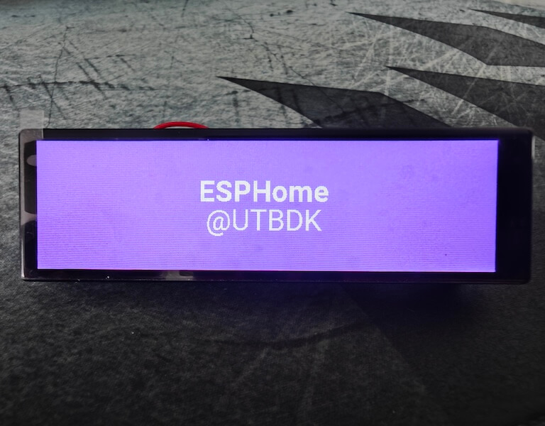

# `ESPHome` components

A collection of my ESPHome components. Tested on ESP Home v2024.12.2 and may be broken on older ones :)

To use this repository you should confugure it inside your yaml-configuration:
```yaml
external_components:
  - source: github://buglloc/esphome-components
    refresh: 10min
```

You can take a look at samples of usage of those components in [examples](examples) folder.

## [axs15231](components/axs15231) display (wip)

[AXS15231](docs/datasheet/AXS15231_Datasheet_V0.4_20221108.pdf) Display used (and tested) on [T-Display S3 Long](https://www.lilygo.cc/products/t-display-s3-long):


Requirements:
  - ESP-IDF framework so far
  - [Quad SPI](https://github.com/esphome/esphome/pull/5925)

Minimal example:
```yaml
external_components:
  - source: github://buglloc/esphome-components
    components: [ axs15231 ]

spi:
  id: quad_spi
  clk_pin: 17
  data_pins:
    - 13
    - 18
    - 21
    - 14

display:
  - platform: axs15231
    dimensions:
      height: 640
      width: 180
    auto_clear_enabled: false
    cs_pin: 12
    reset_pin: 16
    backlight_pin: 1
    rotation: 0
    lambda: |-
      it.fill(Color::random_color());
```

See the [full example](examples/axs15231/t-display-s3-long-landscape.yaml) in the [examples](examples) folder.

Post about: [ESPHome: T-Display S3 Long](https://ut.buglloc.com/2024/03/t-display-s3-long-esphome/)

## [SY6970](components/sy6970) PMU (wip)

Currently, it only performs one task - turning off the [annoying state LED](https://ut.buglloc.com/assets/videos/t-display-long-pmu-state.webp) on the [T-Display S3 Long](https://www.lilygo.cc/products/t-display-s3-long).

Minimal example:
```yaml
i2c:
  sda: 15
  scl: 10
  id: i2c_bus

sy6970:
  i2c_id: i2c_bus
  state_led_enable: false
```

See the [full example](examples/sy6970/t-display-s3-long.yaml) in the [examples](examples) folder.

## [PinkyWinky](components/pinky_winky) integration

[PinkyWinky](https://github.com/buglloc/pinky-winky/) (BLE beacon) integration.

Requirements:
  - ESP-IDF (requires `esp32_ble_tracker`)

Minimal example:
```yaml
external_components:
  - source: github://buglloc/esphome-components
    components: [ pinky_winky ]

time:
  - platform: homeassistant

esp32_ble_tracker:

pinky_winky:
  - id: my_pinky
    mac_address: "11:22:33:44:55:66"
    secret: "so-secret-much-strong"

binary_sensor:
  - platform: pinky_winky
    id: my_pinky_button
    input: my_pinky
    name: "Pinky button"
```

See the [full example](examples/pinky_winky/bike-xiao-esps3.yaml) for usage with  [Seeed Studio XIAO ESP32S3](https://wiki.seeedstudio.com/xiao_esp32s3_getting_started/) in the [examples](examples) folder.

Post about: [Open Sesame: PinkyWinky](https://ut.buglloc.com/2024/06/open-sesame/)
